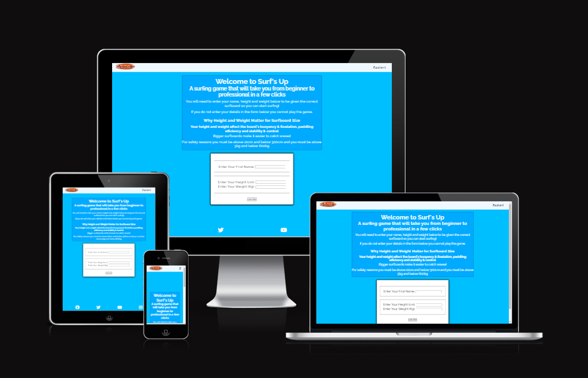
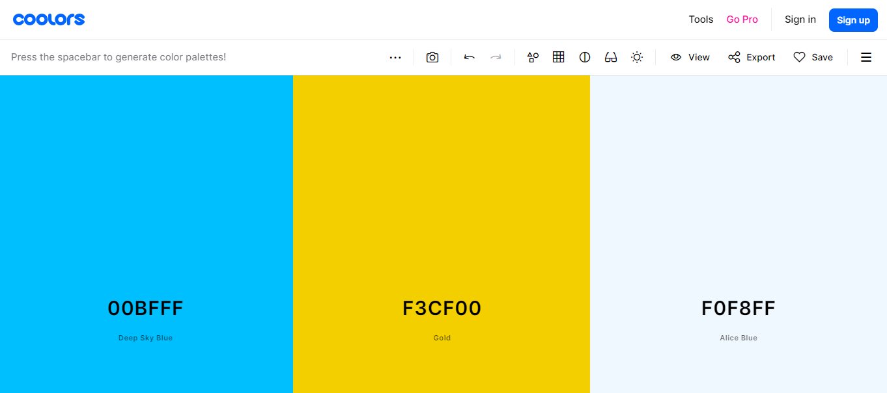
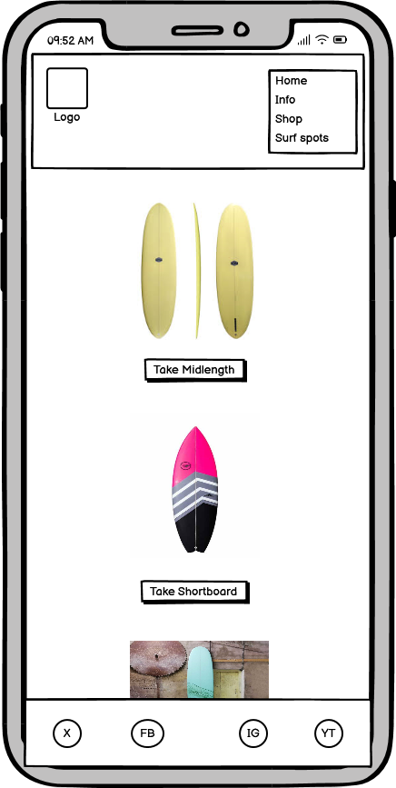
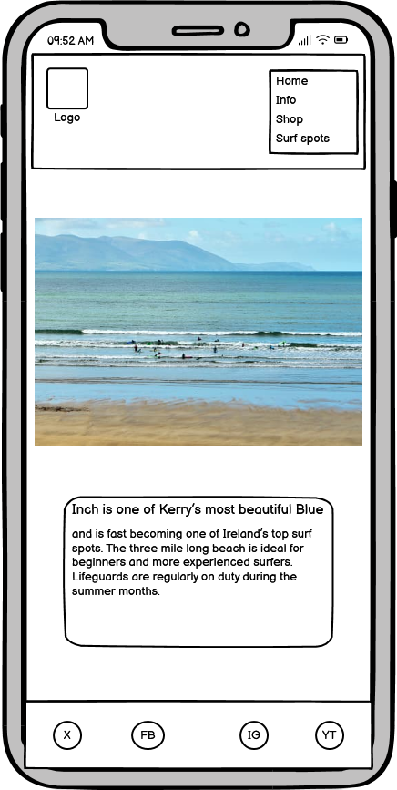
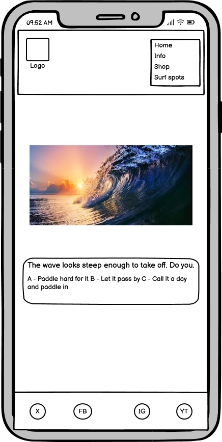
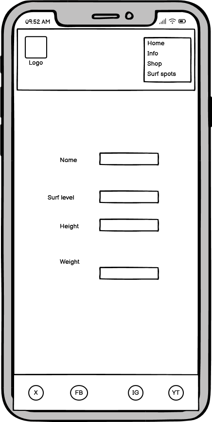
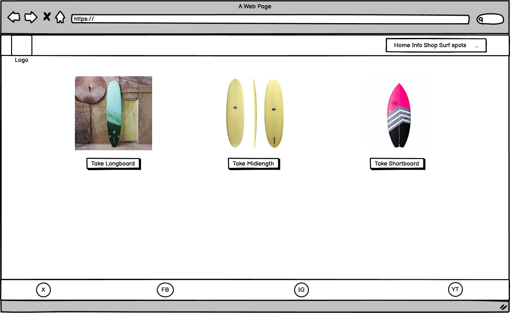
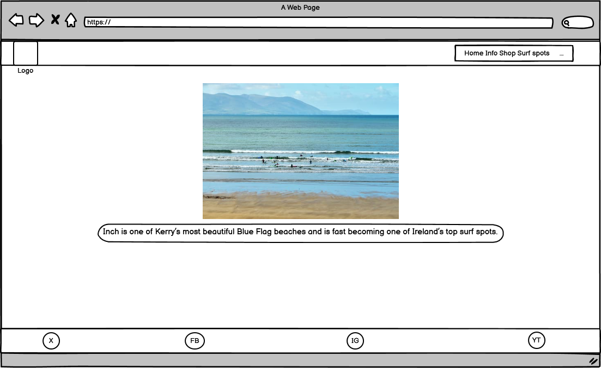
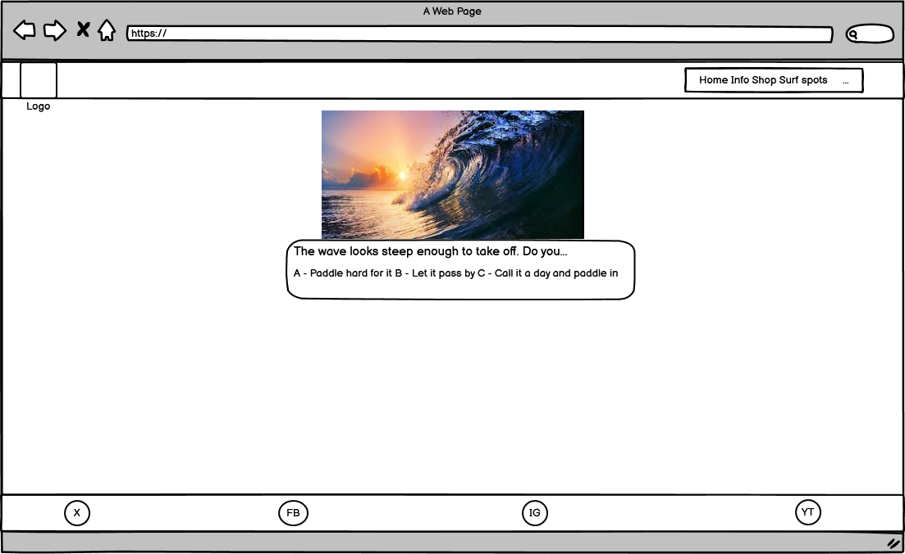
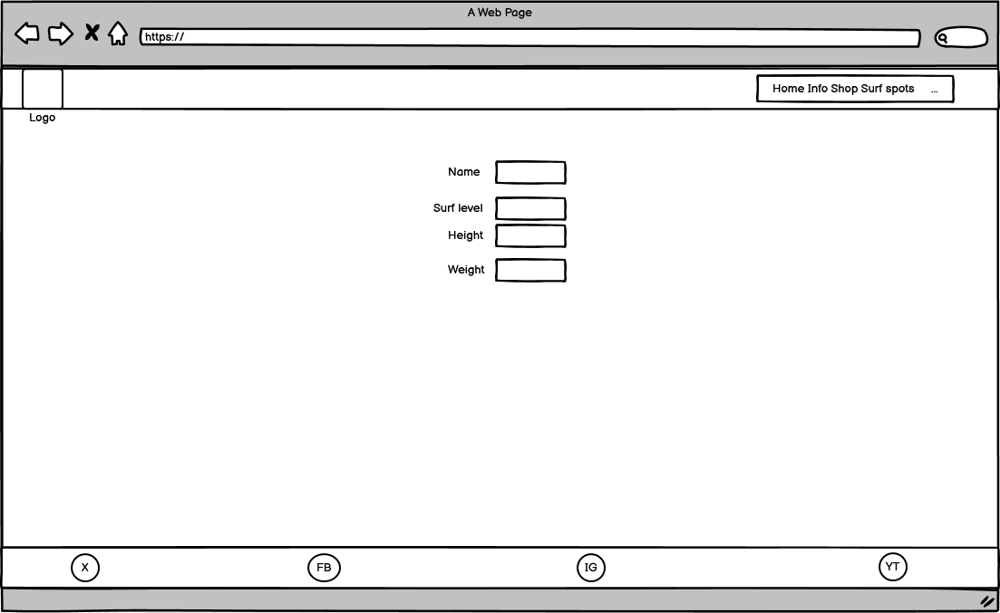

# Surf's Up
Surf's up is a text based surfing game. You begin the game as a surfing kook and by the end you become an advanced surfing expert capable of riding the biggest waves.  

Visit the site [here](https://fergal92.github.io/pp2-surf-s-up/index.html)

## Responsive image

## User stories

### As a user I can easily navigate the site
#### Acceptance Criteria:
- Have a nav nar that works
- Have a nav bar that is always visible
#### Tasks:
- Build an easy to use navbar
- Have the nav bar stick to the top of the page at all times

## Agile Methodologies
### GitHub Projects
Link to the GitHub project page that was used to manage the website build. Items were added to the kanban board and worked through. Items were linked to the project repo and closed off as the project progressed. [github project board](https://github.com/users/fergal92/projects/2/views/1)
## Features
### Existing Features

#### Navigation Bar
- Located at the top of the page at all times. Provides an audio stop/start button, a restart link and a logo that links back to the index.html page
#### Data collection form
- Form on the index page to gather the users name, height and weight data
- height and weight data are used to calculate what size of surboard will be assigned to the user
#### The Footer
- The footer section includes links to relevant social media sites. The links open to a new tab to allow for easy navigation for the user.
- The footer sticks to the bottom of the page
#### Modal message
- Modal pop up message to tell the user the game has started
#### Surf game
- Game contains an image of the surfboard the user has been assigned and the surf spot they will surf at. The surf spot and surf board are determined by the level of the player. There are three levels, beginner, intermediate and advanced
- Gifs based on the id nummber of the textNodes Array.
- Option buttons based on the id number of the textNodes Array. 
- Three audio tracks that play based on the level of the user at the time. The audio can be played and paused using the audio control button in the nav bar.
### Features left to implement 
- An info page based on the surfboard types and the different surf spots. The page would contain information and further explain surfing concepts.
- Furter surfing manouvers and more difficult levels to the game
## Technologies Used
- [HTML](https://developer.mozilla.org/en-US/docs/Web/HTML) - was used as the foundation of the site.
- [CSS](https://developer.mozilla.org/en-US/docs/Web/css) - was used to add the styles and layout of the site.
- [CSS Flexbox](https://developer.mozilla.org/en-US/docs/Learn/CSS/CSS_layout/Flexbox) - was used to arrange items simmetrically on the pages.
- [Balsamiq](https://balsamiq.com/) - was used to make wireframes for the website.
- [VSCode](https://code.visualstudio.com/) - was used as the main tool to write and edit code.
- [Git](https://git-scm.com/) - was used for the version control of the website.
- [GitHub](https://github.com/) - was used to host the code of the website.
- [Perplexity AI](https://www.perplexity.ai/) - was used to help develop design ideas such as colour scheme and font type
- [Am I Responsive](https://ui.dev/amiresponsive) - was used to generate an image of the website across different screen types and resolutions
- [GitHub Pages](https://pages.github.com/) - was used to host the website

## Design
### Colours

I used perplexity AI to generate colour schemes for Surf's Up. The colour scheme I decided to use was described as follows by Perplexity AI:

Coastal Vibes
Primary color: #00BFFF (Deep Sky Blue)
Secondary color: #F0F8FF (Alice Blue)
Accent color: #FFD700 (Gold)
This color scheme evokes the feeling of being near the ocean, with the deep sky blue representing the vast sea, the alice blue mimicking the color of the sky, and the gold adding a touch of warmth like the sun.

## Typography
For fonts I asked Perplexity AI to suggest fonts suitable for a surf based website. I chose the following set:

Tropical Escape
Raleway: A geometric sans-serif with a warm, inviting tone. It has a large family with many weights, making it suitable for headings, body text, and UI elements.

Yellowtail: A playful, bouncy script font that brings to mind tropical cocktails and palm trees. Use it for logos, titles, or short phrases.

Kalam: A hand-drawn, casual font with a handwritten feel. It works well for body text in a tropical-themed design
.
### Wireframes
#### Mobile Wireframes

#### Desktop Wireframes

## Testing
Please refer to the [TESTING.md](TESTING.md) file for all testing documentation
## Deployment

### Deployment to GitHub pages
The site was deployed on gitHub pages on day 1 of the project undertaking. Steps taken are as follows:
- Inside the repo click the settings tab
- Click on pages menu item on the side bar
- Select the main branch and then click the link to go to the live site

The live link to the site can be found here https://fergal92.github.io/pp2-surf-s-up/
### Local Deployment
In order to make a local copy of this project, you can clone it. In your IDE Terminal, type the following command to clone my repository:

`https://github.com/fergal92/pp2-surf-s-up.git`
## Credits
### Content
- The fonts were taken from google fonts 
- Perplexity AI was used to generate the colour scheme
- webDevSimplified javascript game tutorial follow along video was used as inspiration to form the basis of the surf game - https://www.youtube.com/watch?v=R1S_NhKkvGA
### Media
- The photos used in the project were taken from google searches of the web. 
- The Gifs used in the website were taken from google searches for surfing gifs.
- The Favicons were taken for free from this website https://favicon.io/emoji-favicons/
- The icons in the footer were taken from font awesome - https://fontawesome.com/
## Future improvements
- add custom 404 page;
- add further levels and stages to the game with added complextity 
- Add another section with info about the surfboards and surf spots used in the game.
- Add better commit messages from the start of the project
## Acknowledgements
- [Iuliia Konovalova](https://github.com/IuliiaKonovalova) - My mentor Julia was very supportive during this project. She certainly pushed me to complete a high standard of project especially for the readme and testing sections. I took inspiration from her README.md and TESTING.md files for my own.
- [Happiness Generator](https://github.com/broken-helix/happiness/) - My first hackathon project. I learned so much from participating in this project and team. We won the March hackathon for 2024 and my team members were a great source of inspiration for me.
- [freeCodeCamp](https://www.freecodecamp.org/) - I completed the freeCodeCamp responsive web design module before enrolling in code institute and I learned much from that module that I was able to utilise for this project.
