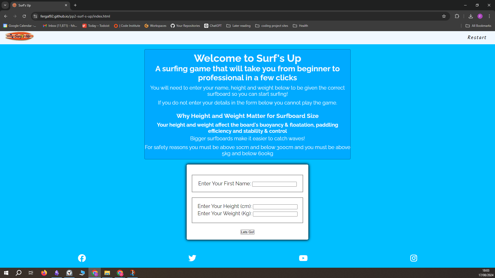
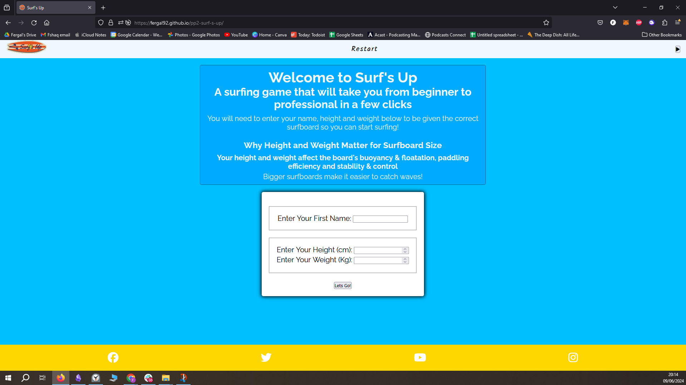
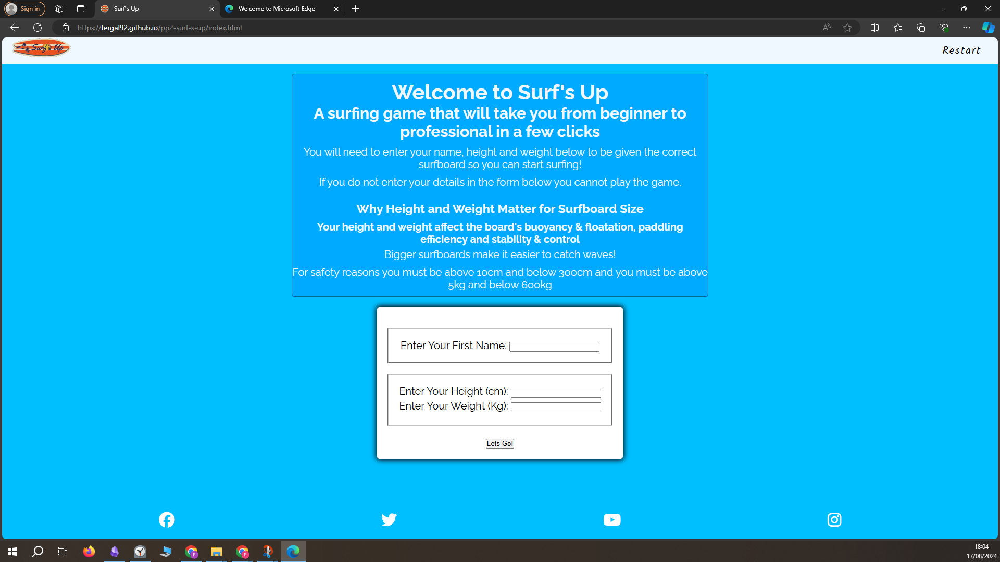
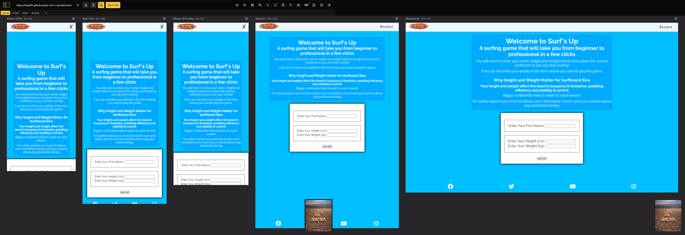
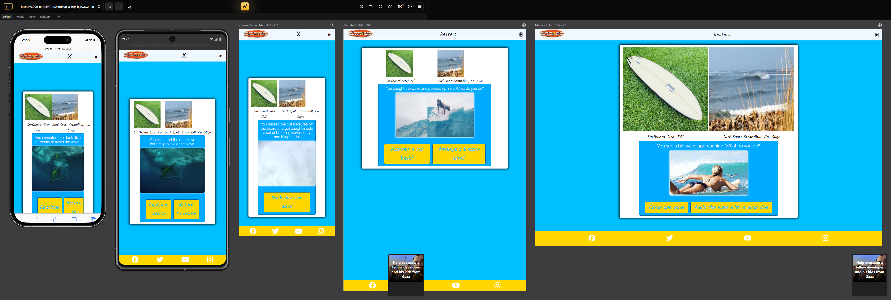
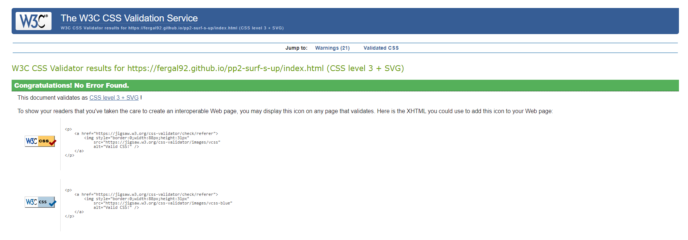
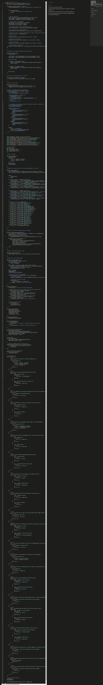

# Testing
## Compatibility
I confirmed the correct functionality, responsivness and appearence by testing the website in Chrome, Firefox and Edge browsers. The website worked without issue in all three.

Chrome browser: 

Firefox browser: 

Edge browser: 

## Responsiveness
The website was checked for responsiveness using the [Responsive Viewer](https://chromewebstore.google.com/detail/responsive-viewer/inmopeiepgfljkpkidclfgbgbmfcennb). The index page with the data input form was tested. Then the index page with the surf game was tested. All pages worked as expected and were responsive. The website is fully responsive and has a mobile first design.

Data input form: 

Surf game: 
## Manual Testing
| feature | action | expected result | tested | passed | comments |
| --- | --- | --- | --- | --- | --- |
| Navbar | | | | | |
| Icon | Click on the Icon link | The user is redirected to the main page | Yes | Yes | - |
| Audio button | Click on the audio button | The user can start and pause the audio | Yes | Yes | - |
| Contact | Click on the "Contact" link | The user is redirected to the contact page | Yes | Yes | - |
| Footer | | | | | |
| Instagram icon in the footer | Click on the Instagram icon | The user is redirected to the Instagram page | Yes | Yes | - |
| Facebook icon in the footer | Click on the Facebook icon | The user is redirected to the Facebook page | Yes | Yes | - |
| Twitter icon in the footer | Click on the Twitter icon | The user is redirected to the Twitter page | Yes | Yes | - |
| YouTube icon in the footer | Click on the YouTube icon | The user is redirected to the YouTube page | Yes | Yes | - |
| Index page | | | | | |
| "Nissan Skyline R34 GT-R " link | Click on the "Nissan Skyline R34 GT-R " link | The user is redirected to an external link of a skyline review on top-gear website | Yes | Yes | - |
| "click here " link | Click on the "click here " link | The user is redirected to the maintenance page | Yes | Yes | - |
| Image map | Click on the image map - various different places | The user is redirected to the maintenance page section that relates to the area of the image they clicked| Yes | Yes | 1024px and over only |
| Contact page | | | | | |
| First name input | Enter Your First Name | The first name is entered | Yes | Yes | If user doesn't enter the first name, the error message appears |
| Last name input | Enter Your Last Name | The last name is entered | Yes | Yes | If user doesn't enter the last name, the error message appears |
| Email input | Enter Your Email | The email is entered | Yes | Yes | If user doesn't enter the email, the error message appears. If user enters not valid email, the error message appears |
| How did you hear about us drop down menu | Click the drop down menu | The drop down menu appears | Yes | Yes | The user is not required to select a drop down list item |
| Please tell us how we can help textarea | The user fills in their message | The message is entered | Yes | Yes | The user is not required to enter input in this textarea|
| I want to hear more checkbox | Click on the checkbox | The checkbox is checked | Yes | Yes | The error message appears unless the checkbox is checked as these checkboxes are required |
| "Rev your engines" button | Click on the "Rev your engines" button | The user is redirected to the thank you page | Yes | Yes | - |
| Thank you page | | | | | |
| Thank you message | The user clicks on the return to home page link| The user is redirected to the home page | Yes | Yes | - |

### Validator Testing

#### HTML
##### Index page

#### CSS
The W3C CSS validation service was used and no validation errors were present

#### javascript
The jshint validator tool was used to validate the javascript code. 0 errors were found and 64 warnings were found

### Accessibility
I confirmed that the colour and fonts are easy to read by running it through lighthouse in chrome devtools I did this for each page of the website

## Bugs
### Solved bugs
- I could not get the audio to not play upon loading the site but I solved that by putting the stopAllAudio function at the end of the js file.
- I could not hide the form and description section at the beginning but I used javascript to change the css display value to hidden
- I could not change the audio based on the surf level but I solved that by deciding which song was to play based on the surfboard state assigned at the time. 

### Unsolved Bugs
- In mobile view the X should be a hamburger icon and it should be on the right of the navbar. Currently it is in the center of the navbar

## Mistakes
- I left it too late to validate the html, css and javascript. Because of this I am forced to rush to try to fix errrors a few hpours before the deadline. This is a mistake