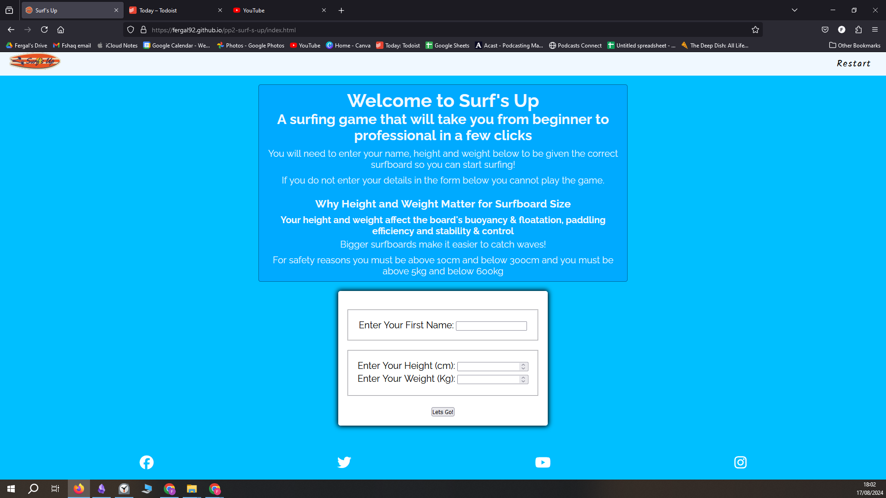
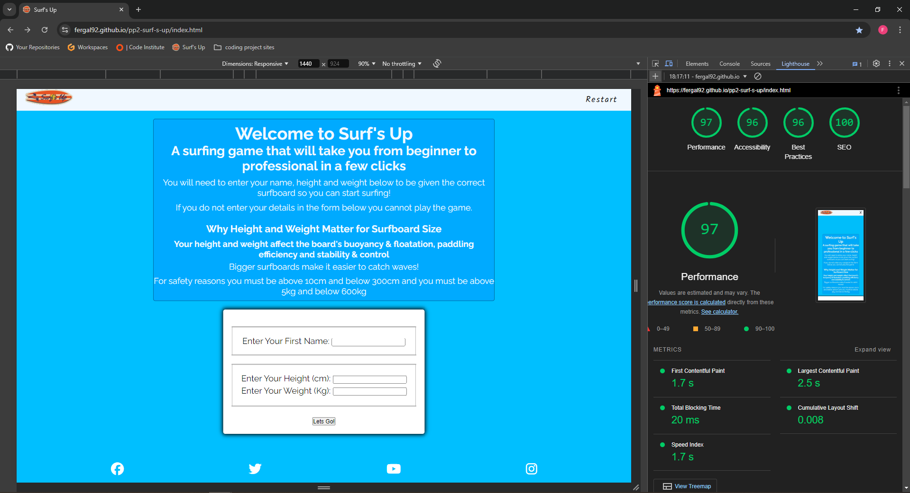

# Testing
## Compatibility
I confirmed the correct functionality, responsivness and appearence by testing the website in Chrome, Firefox and Edge browsers. The website worked without issue in all three.

Chrome browser: 

Firefox browser: 

Edge browser: 

## Responsiveness
The website was checked for responsiveness using the [Responsive Viewer](https://chromewebstore.google.com/detail/responsive-viewer/inmopeiepgfljkpkidclfgbgbmfcennb). The index page with the data input form was tested. The website is fully responsive and has a mobile first design.

Data input form: 

## Manual Testing
| feature | action | expected result | tested | passed | comments |
| --- | --- | --- | --- | --- | --- |
| Navbar | | | | | |
| Icon | Click on the Icon link | The user is redirected to the main page | Yes | Yes | - |
| Audio button | Click on the audio button | The user can start and pause the audio | Yes | Yes | - |
| Footer | | | | | |
| Instagram icon in the footer | Click on the Instagram icon | The user is redirected to the Instagram page | Yes | Yes | - |
| Facebook icon in the footer | Click on the Facebook icon | The user is redirected to the Facebook page | Yes | Yes | - |
| Twitter icon in the footer | Click on the Twitter icon | The user is redirected to the Twitter page | Yes | Yes | - |
| YouTube icon in the footer | Click on the YouTube icon | The user is redirected to the YouTube page | Yes | Yes | - |
| Index page | | | | | |
| Form| Enter data and click submit | The user's data is used to calculate surboard size and name is used in welcome modal message | Yes | Yes | - |
| Surf game | Click option buttons |The user clicks various option buttons that are linked to id's in the javascript file and affect the outcome of the game | Yes | Yes | - |

### Validator Testing

#### HTML
##### Index page

#### CSS
The W3C CSS validation service was used and no validation errors were present

#### javascript
The jshint validator tool was used to validate the javascript code. 0 errors were found and warnings were found. All semicolon warnings were resolved.

### Accessibility
I confirmed that the colour and fonts are easy to read by running it through lighthouse in chrome devtools I did this for each page of the website. The performance is lower than expected due to the use of gifs and audio in the project. This was to be expected.

## Bugs
### Solved bugs
- I could not get the audio to not play upon loading the site but I solved that by putting the stopAllAudio function at the end of the js file.
- I could not hide the form and description section at the beginning but I used javascript to change the css display value to hidden
- I could not change the audio based on the surf level but I solved that by deciding which song was to play based on the surfboard state assigned at the time. 

### Unsolved Bugs
- In mobile view the X should be a hamburger icon and it should be on the right of the navbar. Currently it is in the center of the navbar.
- Audio - I know that the audio should not play unless it has been clicked to play with the audio control buttons. My mentor made that clear to me in the last mentor meeting hours before the deadline but i di not have time to implement the change. It also took me a long time to create the functionality for the audio to begin playing when the option button was clicked to inititae the game and ti update the audio track when the game level increased. In future I would make the audio only play when the audio control button is clicked.

## Mistakes
- I left it too late to validate the html, css and javascript. Because of this I am forced to rush to try to fix errrors a few hpours before the deadline. 
- I used the same ID twice in the html and that became an issue to solve
- Audio - I know that the audio should not play unless it has been clicked to play with the audio control buttons. My mentor made that clear to me in the last mentor meeting hours before the deadline but I did not have time to implement the change. It also took me a long time to create the functionality for the audio to begin playing when the option button was clicked to inititae the game and ti update the audio track when the game level increased. In future I would make the audio only play when the audio control button is clicked.
